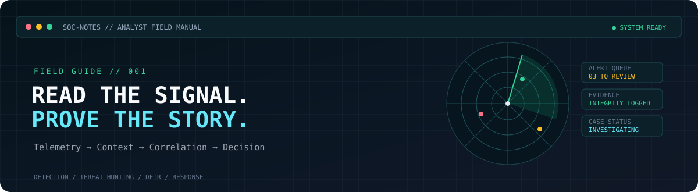

# TRYHACKME // SOC LEVEL 1 FIELD NOTES

**Room links. Spoiler-free study sheets. Analyst-quality lab reporting.**

[Official SOC L1 Path](https://tryhackme.com/path/outline/soclevel1) · [Write-up Template](writeup-template.md) · [Alert Triage Notes](01-alert-triage.md) · [SIEM Notebook](03-siem-triage-notebook.md)

---

## Read this before publishing a lab write-up

This is an independent learning companion; it is **not an official TryHackMe resource**. The room links below point to TryHackMe. Our pages explain general analyst workflows, transferable skills and how to document your own learning.

**No flags, room answers or active-room walkthroughs are included.** TryHackMe's current [Acceptable Use Policy](https://tryhackme.com/legal/acceptable-use-policy) prohibits publishing flags, answers, solutions or step-by-step walkthroughs for active content. Certification/exam content has separate permanent restrictions. Keep your own notes focused on concepts, evidence handling, mistakes, defensive reasoning and lessons learned; check the current policy before publishing room-specific details.

## How to use this hub

1. Open the official room and complete it yourself.
2. Use the relevant field note here to understand the underlying analyst skill—not to replace the room.
3. Save your own observation in [the write-up template](writeup-template.md). Keep any room-specific answers, flags and restricted details out of public commits.
4. Explain your conclusion using evidence, uncertainty and a next action. A public portfolio should show your thinking, not just that you obtained a flag.

## SOC L1 learning route

The official path currently groups content around foundations, SOC operations, core security tools, defence frameworks, phishing, network traffic/security, web security, Windows/Linux monitoring, malware, threat intelligence, SIEM triage and capstone challenges. Room access and content can change; use the official path as the source of truth.

### 01 · Blue Team foundations & day-to-day SOC work

| Official room | Skill to practise | Companion notes |
|---|---|---|
| [Junior Security Analyst Intro](https://tryhackme.com/room/jrsecanalystintrouxo) | Understand a junior analyst's role, handoffs and alert work | [Alert triage](01-alert-triage.md) |
| [SOC Fundamentals](https://tryhackme.com/room/socfundamentals) | People, process, technology, detection and response | [Alert triage](01-alert-triage.md) |
| [SOC Role in Blue Team](https://tryhackme.com/room/socroleinblueteam) | Team boundaries and escalation | [Write-up template](writeup-template.md) |
| [Humans as Attack Vectors](https://tryhackme.com/room/humansattackvectors) | Phishing, human risk and contextual evidence | [Phishing analysis](02-phishing-analysis.md) |
| [Systems as Attack Vectors](https://tryhackme.com/room/systemsattackvectors) | Host behaviour and system-level attack surface | [Host telemetry](05-host-telemetry.md) |

### 02 · SOC internals: triage, reporting, workbooks and metrics

| Official room | Skill to practise | Companion notes |
|---|---|---|
| [SOC L1 Alert Triage](https://tryhackme.com/room/socl1alerttriage) | Alert fields, status, prioritisation and evidence-based verdicts | [Alert triage](01-alert-triage.md) |
| [SOC L1 Alert Reporting](https://tryhackme.com/room/socl1alertreporting) | Clear comments, handoff and escalation | [Write-up template](writeup-template.md) |
| [SOC Workbooks and Lookups](https://tryhackme.com/room/socworkbookslookups) | Repeatable playbooks and enrichment context | [SIEM notebook](03-siem-triage-notebook.md) |
| [SOC Metrics and Objectives](https://tryhackme.com/room/socmetricsobjectives) | MTTD/MTTR, quality and workload measures | [Write-up template](writeup-template.md) |

### 03 · Core SOC solutions

| Official room | Skill to practise | Companion notes |
|---|---|---|
| [Introduction to EDR](https://tryhackme.com/room/introductiontoedrs) | Endpoint telemetry, investigation pivots and approved response | [Host telemetry](05-host-telemetry.md) |
| [Introduction to SIEM](https://tryhackme.com/room/introtosiem) | Collection, parsing, normalization and correlation | [SIEM notebook](03-siem-triage-notebook.md) |
| [Splunk: The Basics](https://tryhackme.com/room/splunk101) | Search, filter, transform and inspect events | [SIEM notebook](03-siem-triage-notebook.md) |
| [Elastic Stack: The Basics](https://tryhackme.com/room/investigatingwithelk101) | Query and investigate events in Elastic | [SIEM notebook](03-siem-triage-notebook.md) |
| [Introduction to SOAR](https://tryhackme.com/room/soar) | Playbooks, integrations and automation safeguards | [Write-up template](writeup-template.md) |

### 04 · Defence frameworks & threat intelligence

| Official room | Skill to practise | Companion notes |
|---|---|---|
| [Pyramid of Pain](https://tryhackme.com/room/pyramidofpainax) | Compare the usefulness and durability of indicators | [Threat intel notes](06-threat-intelligence-and-malware.md) |
| [Cyber Kill Chain](https://tryhackme.com/room/cyberkillchainzmt) | Map activity into a high-level attack sequence | [Write-up template](writeup-template.md) |
| [MITRE](https://tryhackme.com/room/mitre) | Evidence-backed technique mapping | [Threat intel notes](06-threat-intelligence-and-malware.md) |
| [Intro to Cyber Threat Intel](https://tryhackme.com/room/cyberthreatintel) | Assess intelligence context, source and confidence | [Threat intel notes](06-threat-intelligence-and-malware.md) |
| [File and Hash Threat Intel](https://tryhackme.com/room/fileandhashthreatintel) | Handle file indicators and reputation results | [Threat intel notes](06-threat-intelligence-and-malware.md) |
| [IP and Domain Threat Intel](https://tryhackme.com/room/ipanddomainthreatintel) | Enrich network indicators without over-trusting scores | [Threat intel notes](06-threat-intelligence-and-malware.md) |

### 05 · Phishing analysis

| Official room | Skill to practise | Companion notes |
|---|---|---|
| [Phishing Analysis Fundamentals](https://tryhackme.com/room/phishingemails1tryoe) | Sender, headers, URLs, attachments and context | [Phishing analysis](02-phishing-analysis.md) |
| [Phishing Emails in Action](https://tryhackme.com/room/phishingemails2rytmuv) | Combine email artefacts into a defensible assessment | [Phishing analysis](02-phishing-analysis.md) |
| [Phishing Analysis Tools](https://tryhackme.com/room/phishingemails3tryoe) | Use analysis/enrichment tools carefully | [Phishing analysis](02-phishing-analysis.md) |

### 06 · Network traffic & security monitoring

| Official room | Skill to practise | Companion notes |
|---|---|---|
| [Network Traffic Basics](https://tryhackme.com/room/networktrafficbasics) | Direction, endpoints, protocol and time | [Network analysis](04-network-traffic-analysis.md) |
| [Wireshark: The Basics](https://tryhackme.com/room/wiresharkthebasics) | Filters, conversations and packet context | [Network analysis](04-network-traffic-analysis.md) |
| [Wireshark: Packet Operations](https://tryhackme.com/room/wiresharkpacketoperations) | Navigate captures and inspect selected packets | [Network analysis](04-network-traffic-analysis.md) |
| [Wireshark: Traffic Analysis](https://tryhackme.com/room/wiresharktrafficanalysis) | Follow a traffic hypothesis through a PCAP | [Network analysis](04-network-traffic-analysis.md) |
| [Network Security Essentials](https://tryhackme.com/room/networksecurityessentials) | Interpret network alerts and control actions | [Network analysis](04-network-traffic-analysis.md) |
| [Data Exfiltration Detection](https://tryhackme.com/room/dataexfildetection) | Correlate unusual transfer behaviour and context | [Network analysis](04-network-traffic-analysis.md) |

### 07 · Web security monitoring

| Official room | Skill to practise | Companion notes |
|---|---|---|
| [Detecting Web Attacks](https://tryhackme.com/room/detectingwebattacks) | Interpret web request patterns, errors and suspicious sequences | [Network analysis](04-network-traffic-analysis.md) |

### 08 · Windows & Linux security monitoring

| Official room | Skill to practise | Companion notes |
|---|---|---|
| [Windows Logging for SOC](https://tryhackme.com/room/windowsloggingforsoc) | Event channels, relevant fields and event timing | [Host telemetry](05-host-telemetry.md) |
| [Windows Threat Detection 1](https://tryhackme.com/room/windowsthreatdetection1) | Establish hypotheses from Windows telemetry | [Host telemetry](05-host-telemetry.md) |
| [Windows Threat Detection 2](https://tryhackme.com/room/windowsthreatdetection2) | Correlate host events and process context | [Host telemetry](05-host-telemetry.md) |
| [Windows Threat Detection 3](https://tryhackme.com/room/windowsthreatdetection3) | Build a bounded, evidence-backed investigation | [Host telemetry](05-host-telemetry.md) |
| [Linux Logging for SOC](https://tryhackme.com/room/linuxloggingforsoc) | Authentication and system logs | [Host telemetry](05-host-telemetry.md) |
| [Linux Threat Detection 1](https://tryhackme.com/room/linuxthreatdetection1) | Identify suspicious Linux activity from logs | [Host telemetry](05-host-telemetry.md) |
| [Linux Threat Detection 2](https://tryhackme.com/room/linuxthreatdetection2) | Correlate process/authentication/system evidence | [Host telemetry](05-host-telemetry.md) |
| [Linux Threat Detection 3](https://tryhackme.com/room/linuxthreatdetection3) | Document a scoped host investigation | [Host telemetry](05-host-telemetry.md) |

### 09 · Malware concepts & living-off-the-land activity

| Official room | Skill to practise | Companion notes |
|---|---|---|
| [Malware Classification](https://tryhackme.com/room/malwareclassification) | Distinguish malware categories by behaviour | [Threat intel and malware](06-threat-intelligence-and-malware.md) |
| [Intro to Malware Analysis](https://tryhackme.com/room/intromalwareanalysis) | Understand safe static/dynamic triage concepts | [Threat intel and malware](06-threat-intelligence-and-malware.md) |
| [Living Off the Land Attacks](https://tryhackme.com/room/livingoffthelandattacks) | Assess legitimate tools used in suspicious ways | [Host telemetry](05-host-telemetry.md) |

### 10 · SIEM triage & capstone challenges

| Official room | Skill to practise | Companion notes |
|---|---|---|
| [Log Analysis with SIEM](https://tryhackme.com/room/loganalysiswithsiem) | Turn logs into a reproducible investigation | [SIEM notebook](03-siem-triage-notebook.md) |
| [Alert Triage With Splunk](https://tryhackme.com/room/alerttriagewithsplunk) | Scope and document a SIEM alert | [SIEM notebook](03-siem-triage-notebook.md) |
| [Alert Triage With Elastic](https://tryhackme.com/room/alerttriagewithelastic) | Apply triage logic in Elastic | [SIEM notebook](03-siem-triage-notebook.md) |
| [Tempest](https://tryhackme.com/room/tempestincident) | Practise an end-to-end case investigation | [Capstone report guide](07-capstone-report-guide.md) |

The path also lists additional rooms and capstone challenges. See the [official SOC L1 path](https://tryhackme.com/path/outline/soclevel1) for its current complete contents; room names, accessibility and content can change.

## Companion field notes in this repo

- [01 · Alert triage](01-alert-triage.md)
- [02 · Phishing analysis](02-phishing-analysis.md)
- [03 · SIEM triage notebook](03-siem-triage-notebook.md)
- [04 · Network traffic analysis](04-network-traffic-analysis.md)
- [05 · Host telemetry](05-host-telemetry.md)
- [06 · Threat intelligence and malware](06-threat-intelligence-and-malware.md)
- [07 · Capstone report guide](07-capstone-report-guide.md)
- [Room reflection/write-up template](writeup-template.md)

**Use these as study companions, not answer keys.** Complete the room first; then write down what the evidence taught you and how you would apply the same reasoning at work.
