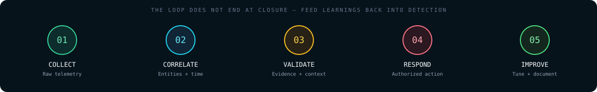

# SOC ANALYST L1 // COURSE NOTES

**English concepts. Hinglish explanations. Analyst-first thinking.**

[Main repository](../README.md) · [Triage Card](../README.md#triage-card) · [Bilingual Glossary](../resources/hinglish-glossary.md) · [Practice Labs](../13-Hands-On-Labs/README.md)

---

Welcome to the main study track. Ye chapters sirf definitions ratne ke liye nahi hain; goal hai ki tum alert ke peeche ka evidence samjho, possible benign explanation check karo, aur apna decision kisi doosre analyst ko clearly explain kar pao.

**How these notes are written / padhne ka tareeqa:** technical terms English mein rakhe hain, explanation natural Hinglish mein, aur jahan useful hai wahan diagrams, queries, interview Q&A aur practice prompts add kiye hain. Source text ka core detail preserve kiya gaya hai, with readability and safety edits.

## Before you start

- **Primary source:** the detailed text notes supplied for this repository.
- **Supplementary PDF:** used only as a high-level cross-reference. That PDF explicitly describes some topics as inferred because a full transcript was unavailable; speculative points are not presented here as confirmed video content.
- **Coverage transparency:** the supplied text includes detailed chapters for Days 1–5 and Days 7–12. It only lists Day 6 and Day 13 in its closing curriculum table, so those two chapters are **expanded from that outline**, not represented as original detailed notes.
- **Lab safety:** query examples and command lines are learning artifacts. Test them only in a lab or environment you are explicitly authorized to use. Never upload sensitive incident files or credentials into public sandboxes.

## Course map

| Day | Topic | Chapter |
|---:|---|---|
| 01 | SOC foundations, roles, metrics and incident lifecycle | [Open Day 01](day-01-soc-foundations.md) |
| 02 | Threat actors, Cyber Kill Chain and MITRE ATT&CK | [Open Day 02](day-02-threat-landscape-attack-frameworks.md) |
| 03 | Network architecture, OSI/TCP-IP and packet analysis | [Open Day 03](day-03-network-architecture-packet-analysis.md) |
| 04 | Firewalls, IDS/IPS, WAF, proxies and perimeter security | [Open Day 04](day-04-perimeter-security.md) |
| 05 | Threat intelligence, IOC/IOA and Pyramid of Pain | [Open Day 05](day-05-threat-intelligence-pyramid-of-pain.md) |
| 06 | Ports, protocols, sockets, DNS tunnelling and DHCP threats | [Open Day 06 · Expanded](day-06-ports-protocols-sockets.md) |
| 07 | SIEM architecture, ingestion and Splunk fundamentals | [Open Day 07](day-07-siem-splunk-architecture.md) |
| 08 | SPL, search patterns, statistics and threat hunting | [Open Day 08](day-08-splunk-search-processing-language.md) |
| 09 | Linux architecture, permissions and CLI triage | [Open Day 09](day-09-linux-security-cli-triage.md) |
| 10 | Linux logs, SSH investigation and Auditd | [Open Day 10](day-10-linux-log-analysis-auditd.md) |
| 11 | EDR/XDR, Sysmon, process trees and LOLBins | [Open Day 11](day-11-edr-xdr-sysmon-lolbins.md) |
| 12 | Malware triage, PE structure, sandboxing and IOCs | [Open Day 12](day-12-malware-analysis-sandboxing.md) |
| 13 | Windows Event IDs and account-compromise timelines | [Open Day 13 · Expanded](day-13-windows-event-log-threat-hunting.md) |

## How to study each day

1. **Read for understanding:** highlight the English definition, then explain it to yourself in Hinglish without looking.
2. **Follow the evidence:** for every alert example ask “source kya hai, time window kya hai, aur is conclusion ko support karne wala data kya hai?”
3. **Challenge the first theory:** write at least one benign explanation and one missing data source.
4. **Practice the output:** complete the chapter prompt and produce a short triage note or timeline.
5. **Revise actively:** answer the interview questions aloud, then validate important platform-specific facts in the official docs.

## Useful companion pages

- [SOC Fundamentals](../01-SOC-Fundamentals/README.md) — short-form reference for roles and triage.
- [Network Security](../02-Network-Security/README.md) — protocol and firewall pivots.
- [Splunk SPL](../03-SIEM-Splunk/README.md) and [Wazuh](../04-SIEM-Wazuh/README.md) — SIEM quick references.
- [Detection Engineering](../07-Detection-Engineering/README.md) and [Sigma use cases](../12-Use-Cases-Sigma-Rules/README.md) — rule quality and testing.
- [Incident Response](../08-Incident-Response/README.md) and [DFIR](../09-DFIR/README.md) — evidence handling and response.
- [Interview Questions](../14-Interview-Questions/README.md) — quick revision.
- [Incident report template](../resources/templates/incident-report.md) and [Threat hunt report template](../resources/templates/threat-hunt-report.md) — reusable outputs.

## The habit that matters most

**Do not confuse an alert with an incident, a reputation score with proof, or missing logs with proof of absence.** Good analysis shows what is known, what is uncertain, what was checked, and what should happen next.
